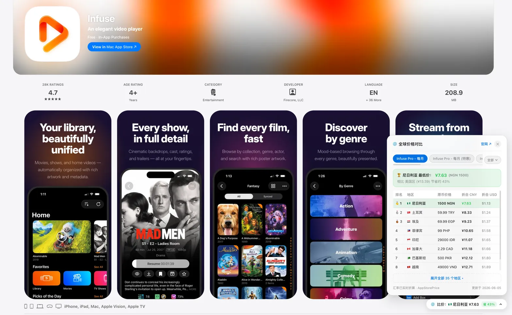

# App Store 比价助手 (App Store Price Helper)

在 **App Store 网页版**（iOS / iPadOS / macOS 等全平台）上优雅查看来自 [AppStorePrice.org](https://appstoreprice.org) 的全球多区比价、最低价区、货币折算与差价对比；若应用尚未收录，支持在页面上**一键请求收录**。



---

## ✨ 核心特性

- 🌐 **全平台支持**：支持 iPhone、iPad、Mac（Mac App Store 独占应用与通用应用）、Apple TV 及 Apple Vision 等 App Store 详情页。
- 🏆 **全球最低价直观呈现**：
  - 自动高亮展示全球最低价国家/地区、原币种价格与折算人民币（CNY）。
  - 自动与当前所在商店区（如国区、美区、日区等）进行基准比价，精确计算省钱百分比（如：“相比中国区节省 41%”）。
- 📑 **多套餐无缝切换**：
  - 针对拥有多个订阅或内购套餐的应用（如按月、按年、终身买断等），提供横向分段选项卡与**右侧 Apple 原生胶囊按钮（`全部` + 矢量 Chevron ⌵）**。
  - **纵向展开选择器**：套餐较多时无需痛苦横向滑动，轻点右侧 `全部 ⌵` 按钮即可一览所有套餐完整名称与特惠标记，**用户点击任意项后自动收起菜单**并秒切比价数据。
  - 采用 Apple SF Symbols 风格的平滑矢量 Chevron 图标，支持展开 180° 弹性倒转动画，彻底摆脱生硬的 Unicode 粗字符。
  - 胶囊徽章与最低价横幅联动更新。
  - 默认展示前 8 名最低价区（附带前三名奖牌 🥇🥈🥉 与各地区专属国旗 Emoji）。
  - 支持一键“展开全部 35 个地区 / 收起”。
  - 同时展示原币价格、折算 CNY（¥）与折算 USD（$）。
- 🚀 **一键请求收录**：
  - 针对 AppStorePrice 尚未收录的应用，页面上优雅展示“暂未收录”提示。
  - 点击“一键请求收录 🚀”按钮，直接向后台提交排队分析请求，并实时反馈状态（“✓ 已加入队列，稍后将自动分析”）。
- 🎨 **Apple 原生质感设计**：
  - 采用 Apple 官网毛玻璃背景、精致圆角与 SF Pro 字体排版。
  - 完美自适应浅色模式（Light Mode）与深色模式（Dark Mode）。
- ⚡ **无缝 SPA 单页跳转**：
  - 监听 App Store 前端路由变动（`pushState` / `replaceState` / `popstate` / `MutationObserver`），在页面切换不同 App 时自动刷新比价面板，无需手动刷新网页。
- 🔒 **严格签名与跨域支持**：
  - 内置 FNV-1a 签名算法，完全符合 AppStorePrice 后台防抓取签名规范。
  - 基于油猴标准 `@grant GM_xmlhttpRequest`，安全绕过 App Store 严格的 CSP 与 CORS 限制。

---

## 💻 支持页面

- `*://apps.apple.com/*/app/*`
- `*://apps.apple.com/app/*`

覆盖示例：
- **iOS / 通用应用**：`https://apps.apple.com/cn/app/infuse/id1136220934`
- **买断型应用**：`https://apps.apple.com/cn/app/shadowrocket/id932747118`
- **Mac 独占应用**：`https://apps.apple.com/cn/app/final-cut-pro/id424389933`

---

## 📦 安装方式

1. 浏览器安装用户脚本管理器扩展（如 **Tampermonkey**、**Violentmonkey**、**ScriptCat** 或 Safari 上的 **Userscripts**）。
2. 在管理器中点击“新建脚本”，将 `appstore-price-helper.user.js` 的完整内容粘贴进去并保存即可。
3. 打开任意 [App Store 页面](https://apps.apple.com/cn/app/infuse/id1136220934)，即可看到比价胶囊。


---

## 📍 交互与显示设计（右侧悬浮窗）

从 **v0.2.0** 起，脚本采用**完全非侵入式（Zero DOM Flow Intrusion）的右侧独立悬浮窗架构**，绝不修改或嵌入 App Store 页面原本的 DOM 排版与 Flex 布局：

### 1. 默认收起态（右下角轻量毛玻璃胶囊浮标）
在屏幕右下角常驻一个极致轻巧、半透明毛玻璃质感的比价胶囊（不挡住任何正文内容）：

                                                 ┌───────────────────────────────────────────────┐
                                                 │ 🌐 比价：🇳🇬 尼日利亚 ¥7.63  [省 43%]  ⌵       │
                                                 └───────────────────────────────────────────────┘
```

### 2. 展开态（点击胶囊滑出完整比价侧边卡片）
点击右下角胶囊，立即在其上方滑出精致的比价卡片面板；再次点击胶囊或点击右上角 `✕` 即可随时收起：

```text
                                 ┌───────────────────────────────────────────────────────────────┐
                                 │ 🌐 全球价格对比                  官网 ↗    [✕]                │
                                 ├───────────────────────────────────────────────────────────────┤
                                 │ [Infuse Pro - 每月] [Infuse Pro - 每年] ...   [全部 ⌵]        │
                                 │ 🏆 尼日利亚 最低价：¥7.63 (相比美国区节省 43%)                 │
                                 │ ───────────────────────────────────────────────────────────── │
                                 │ 🥇 1  🇳🇬 尼日利亚   1500 NGN   ¥7.63    $1.13                  │
                                 │ 🥈 2  🇹🇷 土耳其     59.99 TRY  ¥8.33    $1.24                  │
                                 │ 🥉 3  🇪🇬 埃及       69.99 EGP  ¥9.23    $1.37                  │
                                 │    4  🇨🇳 中国 [当前] ¥13.00     ¥13.00   $1.93                  │
                                 │ [展开全部 35 个地区 ▾]                                         │
                                 └───────────────────────────────────────────────────────────────┘
```

> **注意**：脚本严格仅在 **App 具体详情页**（路径形如 `/app/.../id\d+`）生效；在开发者介绍页（如 `Instagram, Inc.`）或分类列表页不会触发。
---

## ❓ 安装后未显示？排查指南

1. **检查油猴跨域权限（最常见）**：
   - 脚本初次运行时，Tampermonkey / Violentmonkey 会在浏览器右上角或页面弹出权限提示：
     > `用户脚本想要访问外部网站 appstoreprice.org，是否允许？`
   - **必须点击「总是允许此域名」（Always allow domain）**，数据才能成功通过签名接口获取。
2. **检查 F12 控制台输出**：
   - 在 App Store 页面按 `F12`（或右键点击「检查」）切换到 **Console（控制台）**：
   - 若脚本正常运行，会输出一条显眼的蓝色日志：
     > `[AppStorePrice] 比价助手已加载，当前 App ID: 1136220934`
   - 若没有该日志，请检查扩展图标中该脚本是否处于“已启用”（开启开关）状态。
3. **确保脚本版本已更新**：
   - 请使用最新的 `appstore-price-helper.user.js` 代码，新版已针对 App Store Svelte 异步客户端渲染加入了 25 次定时轮询挂载机制，确保 DOM 延迟就绪后必定挂载。
---

## 🛠️ 技术实现要点

- **比价查询接口**：`GET https://appstoreprice.org/api/detail?id={appStoreId}`
  - 带 FNV-1a 32-bit 哈希签名头（`X-Timestamp` 与 `X-Signature`）。
- **收录提交接口**：`POST https://appstoreprice.org/api/app-request`
  - Body: `{ input: appStoreId }`。
- **页面数据联动**：内存 Map 缓存，避免重复网络请求；根据当前 App Store 路径动态提取基准货币与当前区域。

---

## 📄 许可证

[MIT License](../LICENSE)
