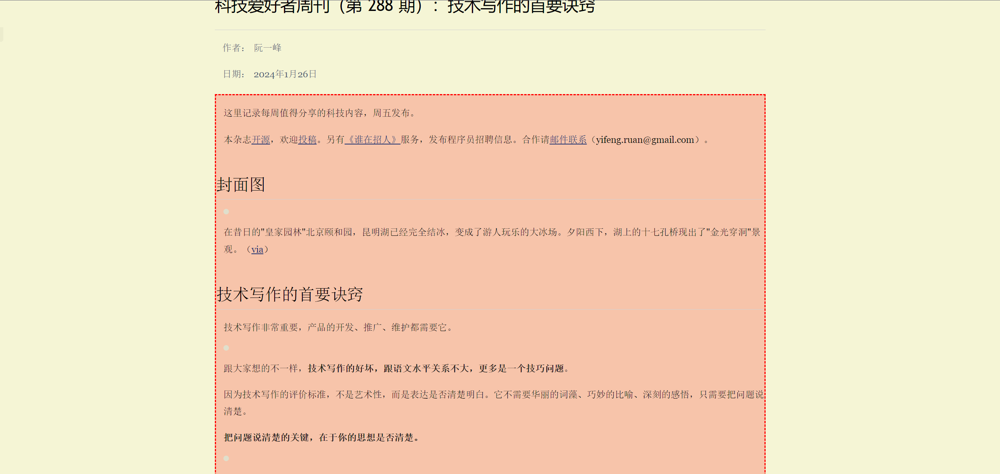
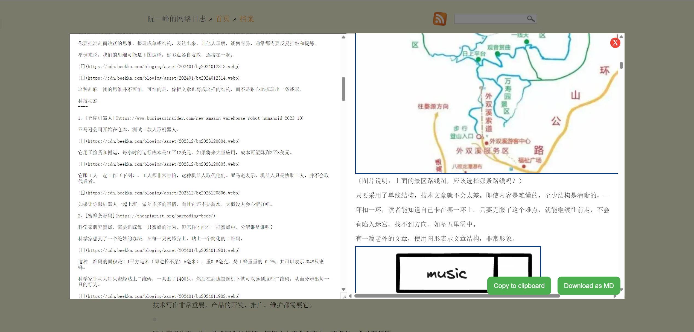

# Easy Web Page to Markdown

"Easy Web Page to Markdown" is a user script that allows you to convert selected HTML from any web page into Markdown format. This is particularly useful for developers, content creators, or anyone who frequently needs to convert HTML content to Markdown.

## Features

- **Selection Tool**: Simply use your mouse to select the HTML element you wish to convert.

- **Markdown Preview**: After conversion, a modal will appear displaying the Markdown equivalent of your selected HTML. It also provides a live preview of the Markdown rendering.
- **Copy to Clipboard**: With just a click, you can copy the converted Markdown to your clipboard.
- **Download as Markdown File**: You can also download the converted Markdown as a .md file.

## Usage

1. Install a user script manager, such as Tampermonkey or Greasemonkey.
2. Add this script to your user script manager.
3. On any webpage, press `Ctrl + M` or open the function from the script manager's menu to start selecting HTML elements.
4. During selection, follow the guide to select elements using the mouse wheel or arrow keys.
5. After selection, you can edit the converted Markdown code on the left, with a preview available on the right.
6. You can either copy the Markdown to your clipboard, download it as a .md file, or configure the code to import it into Obsidian (using [Obsidian Advanced URI](https://vinzent03.github.io/obsidian-advanced-uri/installing)).
